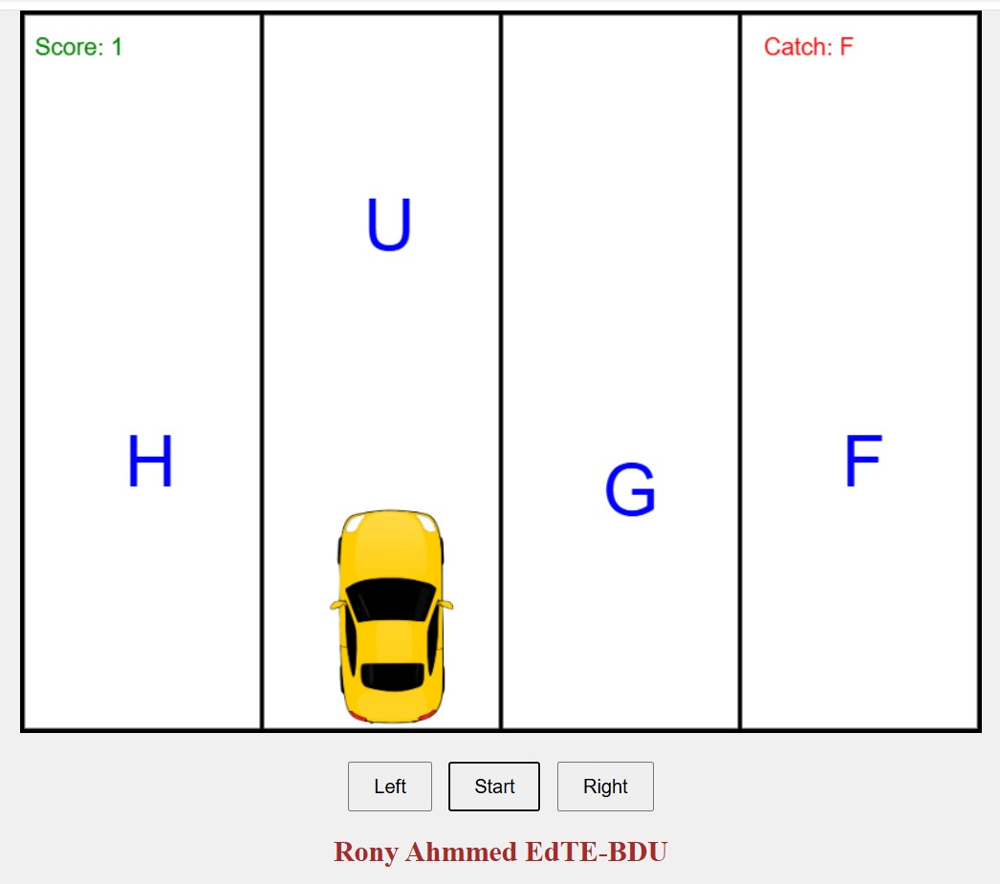

# CarDriving 🚗🎮  
An exciting educational game where you catch letters while driving a car! Sharpen your reflexes and enhance letter recognition skills in a fun and interactive way.  

---

## 🎮 Game Features  
- **Interactive Gameplay:** Drive your car across tracks to catch falling letters.  
- **Educational Focus:** A creative approach to learning and practicing letter recognition.  
- **Dynamic Controls:** Easily switch tracks using left, right, and middle controls.  

---

## 🚀 Live Demo  
Ready to play?  
<a href="https://rony7s.github.io/CarDriving/" style="text-decoration: none; color: brown;"><h2>👉 Play Now 👈</h2></a>  

---

## 📷 Screenshot  
Check out the gameplay:  
  

---

## 🛠️ How to Run  
Follow these steps to play locally:  
1. Clone this repository:  
   ```bash  
   git clone https://github.com/rony7s/CarDriving.git  
